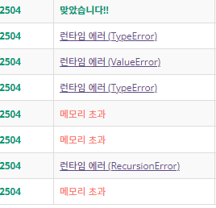

# 2504 괄호의 값

## 1차 시도

```python
import sys
sys.setrecursionlimit(10**6)

str_list = list(input())


def recursion(array):
    new_array = []

    for i in range(len(array)):
		# 여는 건 바로 append
        if array[i] == "(" or array[i] == "[":
            new_array.append(array[i])

        elif array[i] == ")":
            stack = []
            # 뒤에서부터 탐색
            for j in range(len(new_array)-1, -1, -1):
                # 짝이 안 맞으면
                if new_array[j] == "[":
                    print(0)
                    break
                # 숫자라면 스택에 넣어줌
                elif new_array[j] != "(":
                    stack.append(new_array.pop(j))
                # 잘 닫힌다면
                elif new_array[j] == "(":
                    # 바로 닫혔다면
                    if not stack:
                        double = 2
                    # 숫자가 괄호 사이에 있다면
                    else:
                        double = sum(stack)*2
                    # 여는 괄호를 빼고 그 자리에 연산값을 넣어줌
                    new_array.pop(j)
                    new_array.append(double)
                    break
		# 같은 원리
        elif array[i] == "]":
            stack2 = []
            for j in range(len(new_array)-1, -1, -1):
                if new_array[j] == "(":
                    print(0)
                    break
                elif new_array[j] != "[":
                    stack2.append(new_array.pop(j))
                elif new_array[j] == "[":
                    if not stack2:
                        triple = 3
                    else:
                        triple = sum(stack2)*3
                    new_array.pop(j)
                    new_array.append(triple)
                    break
		# 숫자가 나올 때
        else:
            # 닫히는 건 사실 저 위에서 다 없어지기 때문에 여는 게 있는지만 보면 된다
            # 없다면 전부 숫자라는 거고 그걸 다 더하면 값이 되기 때문
            if "(" not in array:
                if "[" not in array:
                    array = [sum(array)]
                    break
            # 뭔가 더 없다면
            if len(new_array) == 0:
                new_array.append(int(array[i]))
            # 괄호 사이에 숫자가 하나뿐이라면
            if new_array[-1] == "[" or new_array[-1] == "]" or new_array[-1] == "(" or new_array[-1] == ")":
                new_array.append(int(array[i]))
            # 계속 숫자가 나온다면
            else:
                num = new_array[-1] + int(array[i])
                new_array.pop()
                new_array.append(num)
	# 숫자가 하나 남는다면 바로 출력
    if len(array) == 1:
        print(array[0])
    # 아니라면 계속 돌리기
    else:
        recursion(new_array)


recursion(str_list)

```

메모리 초과가 나는데 메모리 초과가... 보통 인덱스를 잘못 설정해줘서 그렇다 한다. 근데 역시나 sample input은 맞아서... 보통 난 메모리 초과가 나면 걍 포기하고 새로 짠다


## 2차 시도

```python
import sys
sys.setrecursionlimit(10**6)

str_list = list(input())

new_array = []
result = 0

for i in str_list:

    if i == "(":
        new_array.append(i)
    elif i == "[":
        new_array.append(i)
    elif i == ")":
        if not new_array:
            print(0)
            exit(0)
        temp = 0
        while new_array:
            last = new_array.pop()
            if last == "(":
                if temp == 0:
                    new_array.append(2)
                    break
                else:
                    new_array.append(temp*2)
                    break
            elif last == "[":
                print(0)
                exit(0)
            else:
                temp += int(last)

    elif i == "]":
        if not new_array:
            print(0)
            exit(0)
        temp = 0
        while new_array:
            last = new_array.pop()
            if last == "[":
                if temp == 0:
                    new_array.append(3)
                    break
                else:
                    new_array.append(temp*3)
                    break
            elif last == "(":
                print(0)
                exit(0)
            else:
                temp += int(last)
    else:
        new_array.append(i)

# 3차 시도 때 추가한 것
# 전부 연산을 하고 나서도 닫히지 않은 괄호들이 있다면 망한 거다
for i in new_array:
    if i == "(" or i == "[":
        print(0)
        exit(0)

result = sum(new_array)
print(result)

```

더 직관적이라 주석은 따로 달지 않았는데... 고치면서 무슨 각종 에러를 다 만났다



* 힘들었다...

* 마지막 열린 괄호가 있다는 걸 전혀 고려하지 못 해서 애를 먹었던 것 같다

* 그리고 exit(0)을 배웠다
  바로 프로그램을 종료하는 거래 약간 함수 만들 때 `return`과 비슷한 용도인 거 같다. 만약 함수로 짜지 않는다면 꽤 유용할 것 같다.