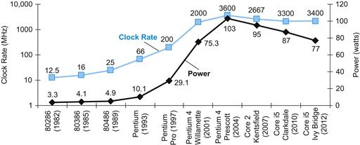

# 01. Performance

## Performance

### Measuring Execution Time

이어...

* **CPU time
  = CPU clock cycle / clock rate 
  = CPU clock cycle * cycle time**
  왜냐면 clock period 는 1/clock rate니까
* 결론적으로 사이클 줄이면 시간이 짧고 성능이 올라감
* 보통 Clock rate를 높이면 cycle count도 올라감... 그래서 하나는 내어줘야(trade off) 한다. 그 둘의 중간을 잘 잡아서 가장 성능이 가장 좋은 수치를 알아내야 한다

### Instruction Count and CPI

* 1. Instruction Count = IC: 명령어의 수 
     IC는 program, ISA, and compiler에 의해 결정된다 
  2. Cycles per Instruction = CPI: 명령어를 수행하는 데 몇 사이클이 필요한가?
     고로 한 번에 이 명령어를 한 번에서 두 번 할 수 있게 됐다면 CPI는 /2

* &rarr; **clock cycles = Instruction Count * CPI**

* 그러므로
  **CPU time = IC * CPI * Clock Cycle Time = IC * CPI / Clock Rate** 

* Average Cycles per Instruction

  * 한 프로그램 안에 있는 여러 개의 명령어들의 비율을 계산한 Average Cycles per Instruction는 CPU 하드웨어에 의해 결정된다
  * 다른 명령어들은 다른 CPI를 가지기 때문에 average CPI는 instruction mix에 영향을 받음
  * 명령어의 갯수, CPI뿐만 아니라 그 하나가 얼마나 많이 쓰이는지에 따라 달라진다
    * clock cycles = (CPI * instruction count)들의 합
    * weighted average CPI 
      = (CPI * (이놈의 instruction count / 평균 instruction count)) 의 합

  * 말하자면 이 프로그램에서 이 명령어가 많이 쓰였는지를 나타내는 frequency가 가중치라 보면 된다

* cf) ISA가 같다면 instruction count가 같다고 보면 되는구나

### 정리

* CPU time 
  = instructions / program * clock cycles / instruction * seconds(전체 걸린 시간) / clock cycles
  = **IC * CPI * Clock Period**

* 그러므로 performance는 아래 이유에 의해 영향을 받는다
  * 알고리즘(은 IC, CPI에 영향)
  * 프로그래밍 언어 (도 IC, CPU에 영향)
  * compiler(IC, CPI에 영향)
  * instruction set architecture(IC, CPI, clock period에 영향)

## The Power Wall

### Power and The Power Wall

**Power = Capacitive load \* (voltage\**2) \* clock freq**

#### power trend 그래프

* 2004년 2005년 둘이 맞닿은 그 시기를 주목해보면 그 시기 이후로 CR은 정체되어 있고 power도 급격히 증가했다가 거꾸로 떨어짐
* 이 곳을 Power Wall이라 한다
* voltage는 1V에서 더 줄일 수 없는데 freq를 계속 올리면 전력도 계속 소비가 되기 때문에 clock rate가 정체가 왔다는 뜻인 듯

#### power wall

voltage전력 소비량을 더 줄일 수 없어서 나타나는 현상. 전력을 더 많이 쓰면 열이 더 많이 나는데 열을 잡을 해결책이 없음 열 문제 때문에 freq를 더 늘리지 못하는 거네 원래는 freq를 올리는 방법으로 성능을 높였거든 근데 이제 못 하는 거임

#### 그러면 어떻게 다른 방법으로 성능을 향상시킬 수 있을까?

* 그래서 나온 게 multicore microprocessors
  : 하나의 칩에 여러 프로세서가 들어가서 여러 개를 동시에 돌릴 수 있는 parallel programming이 가능해진 것 프로그램 자체를 여러 개 돌리는 거지
* 근데 이거는
  * 프로그래밍 하기가 어려움 여태까지의 순차적인 방식이 아니므로
  * 로드 밸런싱 (하나는 오래 걸리고 or not, 하나는 자주 해야 되고 or not) 
  * 싱크로 최적화도 어려움
* 그래서 parallel 하면 생각보다 성능이 낮을 때가 있음 ㅋㅋㅋㅋ 아나

### SPEC CPU Benchmark

* SPEC이라는 회사에서 표준화된 성능 기준(=benchmark)를 수립, 배포한다

#### SPEC CPU benchmark

* I/O는 아주 짧고 CPU performance만 따져서 측정하기 쉽다
* 두 가지 타입: 정수형이랑 실수형이 있대 그걸 geometirc mean을 사용해서 따진다고

#### SPEC Power benchmark

1초에 서버사이?? power 단위는 Watts 실ㅇ행한 ????? server operatiing ㅇ??

숫자가 높을수록 좋대

pitfall: Amdahl's Law

하나의 컴포턴트의 성능을 높이면 그 컴포넌트가 전체의 비율만큼 전체overall 성능이 높아진다

또 식이 있네?

잘 기억하래

한 부분을 향상시키면  그 부분이 전체 성능에서 차지하는 것만큼 비례해서 성능이 높아진다 그러므로 전체 선능에서 많이 차지하는 부분을 성능 향상 시키는 게 훨씬 효율적이네 그러니까 중요한 부분 성능을 향상시켜야

## Fallacies and Pitfalls

### fallacy: low power at idle

* i7 기준 100% load에 258W, 10% load 에 121W 정도 드는데 이건 정비례하는 게 아니다
* 근데? 생각해보면 우리는 보통 10%-50% 밖에 안 쓰는데 258/10 이 아닌 121W나 쓰다니 이건 전력 소비량이 너무 낭비된다는 말씀
* 그래서 하드웨어 디자이너들은 로드의 비례하게 전력을 소비할 수 있게끔 만드는 게 중요하다

### Pitfall: MIPS as a performance Metric

* MIPS: Millions of Instructions Per Second
* 이게 높을수록 성능이 좋다
* MIPS = Clock rate / CPI*10**6
  * CPI에 의해 결정된다는 말씀
  * CPI는 한 CPU 안이라도 프로그램마다 다르니까 그걸 고려하지 못한 거임
  * 즉 컴퓨터마다 다른 ISA를 고려하지 않았음 & 명령어마다 CPI값이 다르다는 걸 고려하지 않음
