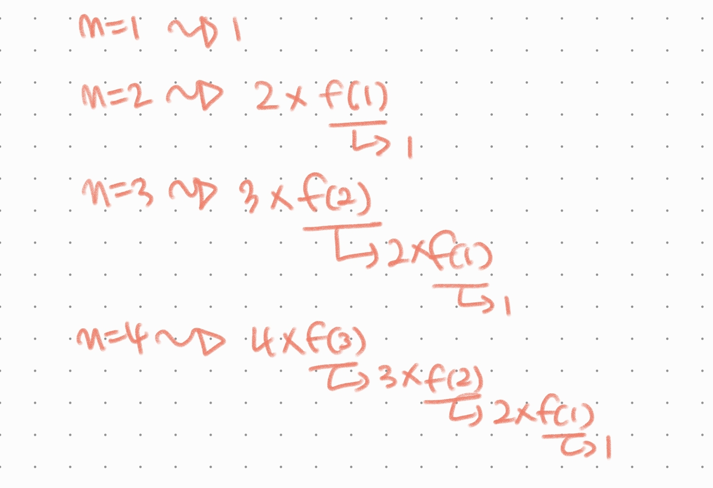

# #02_01_함수

양심선언 이거는! 나도 몰랐따


## 기본 인자 값 (Default Argument Values)

함수에서 입력된 값이 없을 때 나오게 하는 값을 지정할 수가 있다

```python
def greeting(name="뫄뫄씨"):
    # name에 "뫄뫄씨"을 할당하고 그런 건 아니고 걍 특수문법
    return f"{name}, hello?"

print(greeting())  # 뫄뫄씨, hello?
```


range에서도 인자를 생략할 수 있는 것도 이 때문이구나

```python
print(list(range(5)))
# [0, 1, 2, 3, 4]

# 앗 print(range(5))...라고 하지 않도록 조심할 것^^ 
```


**\*주의\* 단, 기본 인자값을 가지는 인자 다음에 기본 값이 없는 인자를 사용할 수 없다!**

```python
# ㄴㅇㄱ
def greeting(name='john', age):
    return f'{name}은 {age}살입니다.'
# SyntaxError: non-default argument follows default argument

# name은 알겠어, 근데 age는 누구냔 말임
```


## 가변 인자

* *args의 형태
* 튜플 형태로 처리가 된다


## 가변 키워드 인자

```python
def my_dict(**kwargs):
    return kwargs

print(my_dict(python= "easy", java = "normal", c = "hard"))

# {'python': 'easy', 'java': 'normal', 'c': 'hard'}
# dict의 형태로 반환
```


## 재귀!!!!!!!!!!!!

```python
def factorial(n):
    if n > 1:
        return n * factorial(n - 1)
    else:
        return 1

factorial(5)
```


